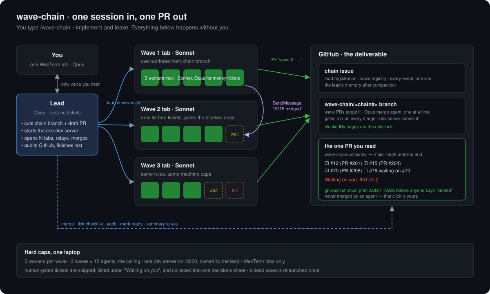
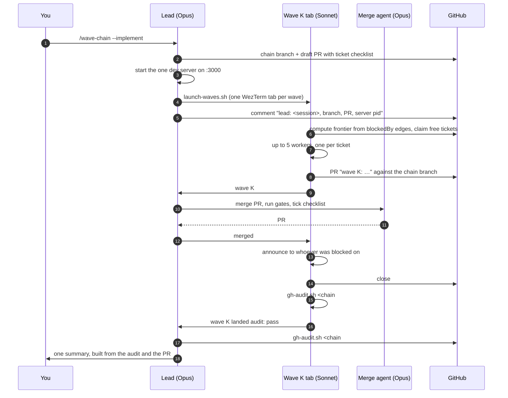

# wave-chain

A Claude Code skill that runs **many orchestrator sessions at once** over one GitHub backlog, one wave each, and hands you back **one PR**.

You open one WezTerm tab and type:

```
claude --autocompact 450k
/wave-chain --implement
```

Then you leave. When you come back, every ticket that did not need you is closed with its evidence on the issue, every wave's PR is merged into one chain branch, and one PR from that branch is waiting for your preview. The tickets that needed a decision from you are listed in that PR under *Waiting on you*, and collected into a single decisions sheet.



---

## Why waves, not one big session

The obvious way to parallelise a backlog is one session that spawns fifteen agents. It works until it doesn't:

- **Context.** One session holding fifteen dispatch prompts, fifteen results and fifteen verifications fills up, gets compacted, and forgets which tickets it owns.
- **Blast radius.** That session hangs or hits a rate limit and all fifteen agents' coordination dies with it.
- **Dependencies.** A single orchestrator keeps the dependency graph in its head and guesses. Separate sessions have to ask GitHub, and GitHub's native `blockedBy` edges are queryable.

So the work is cut into waves, each wave is its own session with its own worktree and its own five-agent budget, and the waves unblock each other by message. A wave is a planning view, not a barrier: a wave with sixteen tickets and two blocked ones runs the other fourteen.

## Why a lead, and why it does nothing

Separate sessions mean separate tabs to read. You don't want that either. So `--implement` with no wave number makes the session you opened the **lead**:

- It launches every wave as a sibling session in its own WezTerm tab. Sibling sessions, not subagents, because a wave needs its own worktree, its own agent budget and a name other sessions can message.
- It is the only session that talks to you. Waves report to it in a fixed two-line shape; it relays each line as it arrives.
- It runs **no tickets**, reads **no diffs**, and keeps **no state in its head**. Merges go through a short-lived merge agent that returns a four-line verdict. Every event is one line on the chain issue, and after a context compaction the lead rebuilds from there.
- It finishes last: final gates, GitHub audit, PR flipped from draft to ready, dev server stopped, one summary to you.
- It hands over before it gets dumb. A lead that has been compacted, or has handled forty events, posts its state on the chain issue, launches a fresh lead in a new tab, tells every wave the new name, and exits. Waves always report to the latest lead.

The lead's context stays small because it never holds anything that isn't a launch, a one-line message or a four-line verdict, and it is replaced before compaction turns it into a summary of itself.

---

## How a run goes



Human-gated tickets never stall a run. A wave that hits one sends `parked-human`, closes out what it did land, and exits. The lead lists those tickets in the PR body and, if there are any, builds the decisions sheet as part of finishing. You answer the sheet in one sitting and run `--implement` again.

---

## Who tests the code

| Layer | Who | What |
|---|---|---|
| Per ticket | the worker | test-first, then two reviewer subagents: one against the ticket's Done-when, one for code quality; tests are run and shown before any completion claim |
| Per wave | the wave orchestrator | reads the verdicts, checks evidence per ticket, Opus review pass on money-moving tickets, GitHub audit for its wave |
| Per merge | the Opus merge agent | full gates on the chain branch, then **smoke on the running dev server**: every route or behaviour a Done-when names is hit on port 3000. Fail bounces and reverts the PR. This is the only moment a change is observable in the app, since a worker's worktree is not what the server serves. |
| End of run | the lead, through agents | final gates, one **review of the whole chain PR** posted as inline comments, blocking findings fixed on the branch, then the audit, then ready for review |

## GitHub is the deliverable

The thing that goes wrong most often with long agent runs: you come back, the chat says "done", and GitHub says otherwise. A ticket left `in-progress`, a closed ticket with no evidence, a PR whose body says "see the diff".

This skill treats that as a state problem, not a discipline problem. [`scripts/gh-audit.sh`](./scripts/gh-audit.sh) reads GitHub and prints a `FAIL` line for every:

- open wave ticket still labelled `in-progress`
- closed ticket whose last comment lacks a PR link and `file:line` evidence
- open ticket with no comment since the chain started
- wave PR not merged into the chain branch
- chain PR still in draft, or missing a tick for a closed ticket

A wave may not say `landed` until the audit passes for its wave. The lead may not finish until it passes for the whole chain, and every `FAIL` at that point is the lead's to fix, including messes left by a wave that died. Nobody hands you a `FAIL` as a to-do.

---

## Models, by role

| Role | Model | Why |
|---|---|---|
| `--read` / `--modify` planning | Opus 5 | One-shot judgement over the whole backlog. A wrong cut costs a run. |
| Lead | Opus 5 | Spends almost nothing after the redesign. Its judgement calls reach you directly. |
| Merge agent | Opus 5 | Cross-wave conflict resolution is where a bad edit silently breaks everyone. |
| Wave orchestrators | Sonnet 5 | Structured work, the largest context growth, 2.5× cheaper than Opus. |
| Ticket workers | Sonnet 5 | Most of the tokens in a run. |
| Money-moving or serialized-file tickets | Opus 5 | Where a cheaper worker's mistake costs more than the model. |
| Read-phase verifiers | Haiku 4.5 | Grep and cite `file:line`. No reasoning depth needed. |

All of this is baked in. The launcher starts wave tabs on Sonnet in `auto` permission mode so nothing stalls on a prompt in a tab nobody is watching. Override with `WAVE_CLAUDE_FLAGS` if you ever need to.

---

## Usage

| You type | It does |
|---|---|
| `/wave-chain`, `--read` | Reads the open issues, verifies each against the actual code, proposes the wave cut and the edges. **Writes nothing.** |
| `/wave-chain --modify` | Applies the plan: closes what already shipped with evidence, labels the waves, creates real `blockedBy` edges, writes the chain issue. Waits for your go before the first write. |
| `/wave-chain --implement` | **Lead mode.** Launches every wave in its own WezTerm tab, merges their PRs into one chain branch, audits GitHub, hands you one PR. |
| `/wave-chain --implement 2`, or `GH Issue #148, Wave 2` | Runs wave 2 by hand, in this session. Reports to the lead if one exists, otherwise to you. |
| `/wave-chain --human` | Collects every decision blocking someone into one sheet, reads your answers back, closes the blockers they clear. |
| `/wave-chain --add 88` | Grafts an issue opened after the chain was built into the running chain, and messages the wave that now owns it. |

**The default reads and does not write.** A command you might run by accident should never label fifty issues.

**Issues drift, so the read verifies them.** Each open ticket comes back `SHIPPED`, `PARTIAL` or `OPEN`, and the only evidence that counts is `file:line` in the repo. Never a doc, a state tracker or a previous session's report.

---

## How many waves, and how big

Two different numbers, easy to confuse:

- **How many waves** is set by the work: the longest dependency chain in the backlog. Three-deep means three waves whether there are twelve tickets or two hundred. No dependencies means one wave. A wide layer is split by area into several waves with no edges between them, so a wave stays around ten to twenty tickets.
- **How many run at once** is set by the laptop: three. A six-wave chain runs through that three at a time; the lead launches the next wave into each freed slot. Later waves depend on earlier ones anyway, so starting them late costs almost nothing.

The cut rules the read phase follows are in §R3 of `SKILL.md`: real edges only, wave equals longest path from a root, never balance by adding edges, split wide layers by area, foundations first inside a wave, human-blocked work last.

## Hard caps

Everything runs on one laptop, so these are ceilings, not targets:

- **Five workers per wave, three waves live at once.** Fifteen agents is the machine's limit.
- **Context windows below the model's.** Wave tabs compact at 600K, leads at 450K. The smart part of a session is its first few hundred thousand tokens; the launcher sets both.
- **One dev server**, on port 3000, started by the lead before any wave exists and stopped by the lead after the last one finishes. A wave never starts or kills one.
- **WezTerm tabs only.** The launcher refuses to run outside WezTerm rather than fall back to another terminal.

Both numbers live in the `## Shared machine` section of `SKILL.md`. Raise them for your hardware, but keep the shape.

---

## Two `gh` traps worth knowing

```bash
# blockedBy comes back as an OBJECT, and includes already-CLOSED blockers.
gh api repos/OWNER/REPO/issues/51/dependencies/blocked_by \
  --jq '[.[] | select(.state=="open") | .number]'
```

Creating an edge takes the blocker's **internal REST `id`**, not its issue number. Pass the number and the edge silently points at the wrong ticket:

```bash
BLOCKER_ID=$(gh api repos/OWNER/REPO/issues/115 --jq .id)
gh api -X POST repos/OWNER/REPO/issues/51/dependencies/blocked_by -F issue_id=$BLOCKER_ID
```

---

## Files

| Path | What |
|---|---|
| `SKILL.md` | The protocol. Modes §R, §M, §L, §I, §H, §D, plus the red-flags list. |
| `scripts/launch-waves.sh` | Opens one WezTerm tab per wave, or a successor lead, each its own Claude session with the right model and context window. |
| `scripts/gh-audit.sh` | Verifies GitHub reflects the run. Exit 1 on any `FAIL`. |
| `references/chain-issue.md` | Template for the chain issue. |

## Adapting it

The protocol is generic. The `## Project conventions` section of `SKILL.md` is not: it names one repo's serialized files, test gates, labels and copy rules. Replace it with your own.

## Requires

- [`superpowers`](https://github.com/obra/superpowers): `subagent-driven-development` fans a wave out, `verification-before-completion` gates the completion claims.
- [WezTerm](https://wezfurlong.org/wezterm/) with `wezterm cli` on the path, for lead mode.
- `gh` and `jq`.
- Sessions address each other with `SendMessage` / `ListAgents`, so orchestrators must be able to see each other as peers.
